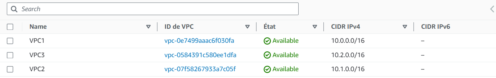
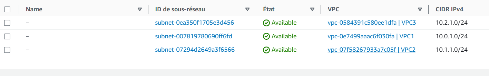
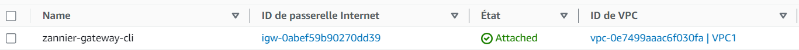
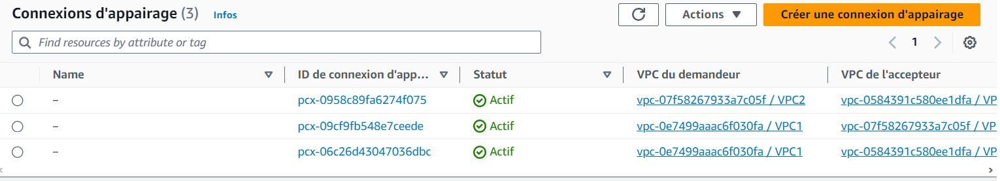
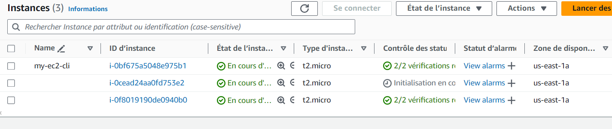
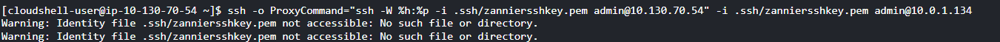
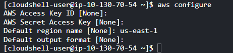

François ZANNIER 
ESTIAM 3

                                    Compte rendu TP AWS

Pour commencer nous faisons un schéma permettant d'avoir une idée du travail à réaliser.

# Création de VPCs

aws ec2 create-vpc --cidr-block 10.0.0.0/16 --query Vpc.VpcId --output text
aws ec2 create-tags --resources vpc-0e7499aaac6f030fa --tags Key=Name,Value=VPC1

aws ec2 create-vpc --cidr-block 10.1.0.0/16 --query Vpc.VpcId --output text
aws ec2 create-tags --resources vpc-07f58267933a7c05f --tags Key=Name,Value=VPC2

aws ec2 create-vpc --cidr-block 10.2.0.0/16 --query Vpc.VpcId --output text
aws ec2 create-tags --resources vpc-0584391c580ee1dfa --tags Key=Name,Value=VPC3

# Création de Sous-réseaux

aws ec2 create-subnet --vpc-id vpc-0e7499aaac6f030fa --cidr-block 10.0.1.0/24 --availability-zone us-east-1a --query Subnet.SubnetId --output text

aws ec2 create-subnet --vpc-id vpc-07f58267933a7c05f --cidr-block 10.1.1.0/24 --availability-zone us-east-1a --query Subnet.SubnetId --output text

aws ec2 create-subnet --vpc-id vpc-0584391c580ee1dfa --cidr-block 10.2.1.0/24 --availability-zone us-east-1a --query Subnet.SubnetId --output text

# Configuration d'Internet Gateway pour VPC1

- Accès Internet : Permet à vos instances dans le VPC de se connecter à Internet et d'être accessibles depuis Internet.

- Routeur Redondant et Fiable : AWS assure une redondance et une évolutivité horizontale de la passerelle Internet, assurant une connexion Internet fiable.

- NAT pour Instances avec Adresses IP Privées : Les instances disposant d'adresses IP privées peuvent accéder à Internet, ou être accessibles depuis Internet (si configuré), via la passerelle Internet agissant comme un NAT.

aws ec2 create-internet-gateway --query InternetGateway.InternetGatewayId --output text
aws ec2 create-tags --resources igw-0abef59b90270dd39 --tags Key=Name,Value=zannier-gateway-cli
aws ec2 attach-internet-gateway --vpc-id vpc-0e7499aaac6f030fa --internet-gateway-id igw-0abef59b90270dd39

# Configuration des Tables de Routage pour chaque VPC

- Connexion à Internet : Les instances dans les sous-réseaux associés peuvent accéder à Internet en associant une table de routage à une passerelle Internet.

- Séparation des Réseaux Internes et Externes : Organisez le trafic Internet et interne en utilisant des tables de routage distinctes, connectées à l'Internet Gateway pour le trafic Internet.

- Contrôle du Trafic Réseau : Décidez où diriger le trafic en fonction de sa destination.

- Routage pour les Connexions d'Appairage VPC ou VPN : Gère le trajet du trafic pour les connexions entre les VPC ou les connexions VPN.

aws ec2 create-route-table --vpc-id vpc-0e7499aaac6f030fa --query RouteTable.RouteTableId --output text

aws ec2 create-route-table --vpc-id vpc-07f58267933a7c05f --query RouteTable.RouteTableId --output text

aws ec2 create-route-table --vpc-id vpc-0584391c580ee1dfa --query RouteTable.RouteTableId --output text

# Association de Sous-réseaux et Tables de Routage

aws ec2 create-route --route-table-id rtb-0f6dde981c46c692b --destination-cidr-block 0.0.0.0/0 --gateway-id igw-0abef59b90270dd39

aws ec2 associate-route-table --route-table-id rtb-0f6dde981c46c692b --subnet-id subnet-007819780690ff6fd
...

# Création et Acceptation des Connexions d'Appairage VPC

aws ec2 create-vpc-peering-connection --vpc-id vpc-0e7499aaac6f030fa --peer-vpc-id vpc-07f58267933a7c05f

aws ec2 create-vpc-peering-connection --vpc-id vpc-07f58267933a7c05f --peer-vpc-id vpc-0584391c580ee1dfa

aws ec2 accept-vpc-peering-connection --vpc-peering-connection-id pcx-09cf9fb548e7ceede

aws ec2 accept-vpc-peering-connection --vpc-peering-connection-id pcx-06c26d43047036dbc

aws ec2 accept-vpc-peering-connection --vpc-peering-connection-id pcx-0958c89fa6274f075

# Création de Groupes de Sécurité et autorisations SSH

aws ec2 create-security-group --group-name zanniergroupecli --description "security group" --vpc-id vpc-0e7499aaac6f030fa

aws ec2 create-security-group --group-name zanniergroupecli --description "security group" --vpc-id vpc-07f58267933a7c05f

aws ec2 authorize-security-group-ingress --group-id sg-0ea2bfb66ca4295d3 --protocol tcp --port 22 --cidr 0.0.0.0/0
aws ec2 authorize-security-group-ingress --group-id sg-0ea2bfb66ca4295d3 --protocol tcp --port 80 --cidr 0.0.0.0/0

aws ec2 authorize-security-group-ingress --group-id sg-0ab84825372013ef1 --protocol tcp --port 80 --cidr 0.0.0.0/0

# Lancement d'Instances dans les sous-réseaux respectifs

- On commence par la création d'une clé SSH

aws ec2 create-key-pair --key-name zanniersshkey --query 'KeyMaterial' --output text > zanniersshkey.pem

- Ensuite on créé une instances avec la commande

aws ec2 run-instances --image-id ami-058bd2d568351da34 --count 1 --instance-type t2.micro --key-name zanniersshkey --security-group-ids sg-0ea2bfb66ca4295d3 --subnet-id subnet-007819780690ff6fd --associate-public-ip-address

aws ec2 run-instances --image-id ami-058bd2d568351da34 --count 1 --instance-type t2.micro --key-name zanniersshkey --security-group-ids sg-0ab84825372013ef1 --subnet-id subnet-07294d2649a3f6566 --no-associate-public-ip-address
...

# Commandes de Connexion SSH

- Je n'ai pas réussi cette étape, car mon fichier ssh était mal référencé, il s'agissait probablement d'une erreur d'addresse

ssh -o ProxyCommand="ssh -W %h:%p -i .ssh/zanniersshkey.pem admin@10.130.70.54" -i .ssh/zanniersshkey.pem admin@10.0.1.134

# Création du bucket 

aws s3api create-bucket --bucket zannier-bucket --region us-east-1

aws configure

- Je n'ai malheureusement pas réussi à aller plus loin avec la création et la mise en place du bucket. 

# Conclusion : 

Malgré mon incapacité à finir ce projet j'ai eu l'occasion de travailler avec AWS qui est un outils très pratique pour la mise en place de serveurs dans le monde professionnel. Ce projet m'as aussi permis de m'améliorer avec l'utilisation du CLI.

